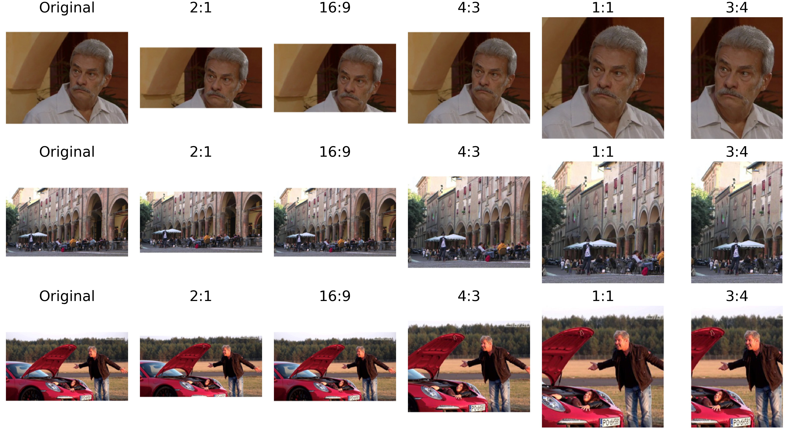

# GNMC

We present the Gracenote Multi-Crop (GNMC) dataset, to further research in algorithms for aesthetic image cropping. The dataset consists of a diverse collection of 10K images, each cropped in five different aspect ratios by experienced editors. GNMC is larger than existing datasets commonly used to benchmark image cropping approaches such as FCDB (1743 images) and FLMS (500 images). This dataset can enable aesthetic cropping algorithms as described in "[An Experience-Based Direct Generation Approach to Automatic Image Cropping](https://ieeexplore.ieee.org/document/9500226/)" by Christensen and Vartakavi. 

<br />




## License

This dataset is distributed under the [polyform non-commercial license](https://polyformproject.org/licenses/noncommercial/1.0.0/).

## Dataset

The dataset is hosted on Zenodo, [download here](https://zenodo.org/record/6228834).

The dataset contains a total of 10k images, split between training(8k), validation (1k) and test (2k) sets. The data for each split is available in the `./json` folder, contains data in the following format:

```
[{'crop_bboxes': {'16:9': [0.01615, 0.06691, 0.98806, 0.78996],
   '3:4': [0.37921, 0.01301, 0.93118, 0.98606],
   '4:3': [0.01404, 0.0158, 0.98596, 0.97955],
   '2:1': [0.0014, 0.1171, 0.99157, 0.77138],
   '1:1': [0.24017, 0.01022, 0.98034, 0.98885]},
  'filename': '009473.jpeg'},
 {'crop_bboxes': {'16:9': [0.00208, 0.0037, 0.99792, 0.99722],
   '3:4': [0.0, 0.0, 0.42083, 1.0],
   '4:3': [0.0, 0.05093, 0.7125, 1.0],
   '2:1': [0.0, 0.11296, 1.0, 1.0],
   '1:1': [0.0, 0.01944, 0.5526, 1.0]},
  'filename': '008917.jpeg'},
 {'crop_bboxes': {'16:9': [0.00125, 0.00222, 0.99812, 1.0],
   '3:4': [0.4275, 0.0, 0.84875, 1.0],
   '4:3': [0.24875, 0.04667, 0.9625, 1.0],
   '2:1': [0.0, 0.07444, 0.99875, 0.96333],
   '1:1': [0.34062, 0.0, 0.90188, 1.0]},
  'filename': '004070.jpeg'}]
```

The images can be found at `./<split>/filename.jpeg`. The bounding boxes for each aspect ratio are stored in normalized format as float values between [0,1]. The example notebook provides details on how to work with these.

## Code

This repository contains a single introduction notebook to illustrate how to work with the dataset.

In the future, this repository may include functions for metrics and other possibly other utilities, trained models, etc.

## Citation


You can cite the dataset like so:

```
Vartakavi, Aneesh. (2022). The Gracenote Multi-Crop Dataset (0.0.1) [Data set]. Zenodo. https://doi.org/10.5281/zenodo.6228834
```

You may also be interested in our related work:

```
C. L. Christensen and A. Vartakavi, "An Experience-Based Direct Generation Approach to Automatic Image Cropping," in IEEE Access, vol. 9, pp. 107600-107610, 2021, doi: 10.1109/ACCESS.2021.3100816.
```
